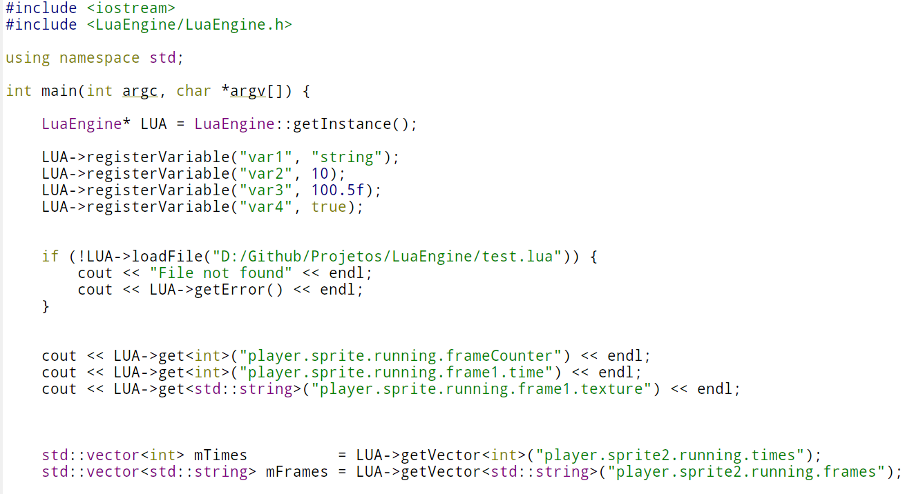

# LuaEngine 
---
Easy and simple way to interact with **Lua**.

### Preview



### How to use
Just include the header file and get/create the instance of the `LuaEngine` object.

```
LuaEngine* LUA = LuaEngine::getInstance();
```

You can pass a boolean as the fist parameter to the `getInstance` to load the LuaLibraries (default to true).

#### Defining variables

```
    LUA->registerVariable("var1", "string");
    LUA->registerVariable("var2", 10);
    LUA->registerVariable("var3", 100.5f);
    LUA->registerVariable("var4", true);
```

#### Loading Lua files

```
	if (!LUA->loadFile("D:/Github/LuaEngine/test.lua")) {
        cout << "File not found" << endl;
        cout << LUA->getError() << endl;
    }
```

#### Getting variables values

```
    cout << LUA->get<int>("player.sprite.running.frameCounter") << endl;
    cout << LUA->get<int>("player.sprite.running.frame1.time") << endl;
    cout << LUA->get<std::string>("player.sprite.running.frame1.texture") << endl;
```

#### Executing custom code

```
    LUA->executeCode("print(width)");
    LUA->executeCode("print(height)");
```

### Function reference

* LuaEngine* getInstance(bool openLibs = true);
* bool loadFile(const std::string &fileName);
* void executeCode(const std::string &code);
* void clearState();
* void registerVariable(variableName, value);
* void printStack();
* void printGlobalTable(const std::string &tableName);
* std::string getError();
* std::vector<T> getVector(const std::string &variableName);
* std::vector<std::string> getTableKeys(const std::string &variableName);
* void clearStack();
* T get(const std::string &variableName);


**NOTE:** Since the default behavior is to open the default lua libraries, if your Lua file or code, contains some sort of user input dependency like `io.read` the program can freeze until it get some input.

The following code will make the program wait input
```
	x = io.read()
	print(x)
```